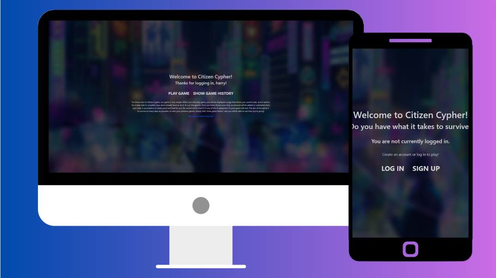
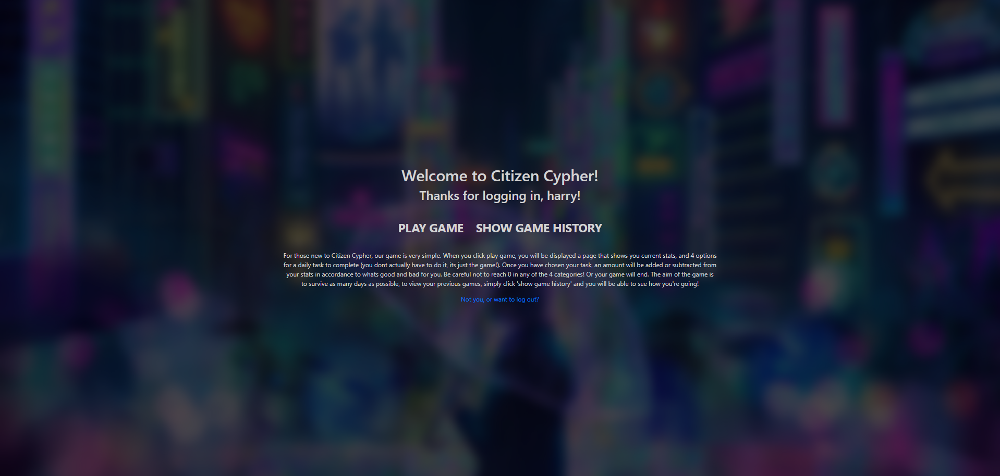

## CitizenCypher



---

Are you bored out of your brains? Play Citizen Cypher today!

---

        	   

[](https://opensource.org/licenses/MIT)

---

✦ [Deployment](#deployment) ✦ [Technologies Used](#technologies-used) ✦ [Images](#current-product) ✦  [Resources](#resources) ✦ [License](#license) ✦ [Contact](#contact)

---


## Deployment

https://citizen-cypher.herokuapp.com/


## Installation 

Whilst we recommend using the application on the deployed site, if you wish to run it on your local machine, you will need to setup your .env variables for the MySQL database

Download and navigate to the root folder, run the following commands in GitBash or VSCode Terminal:

For windows users:
```
python3 -m pip install -r requirements.txt
```
```
python3 -m venv venv
```
```
.\venv\Scripts\activate
```
```
flask run
```

For Mac users: 
```
python3 -m pip install -r requirements.txt
```
```
python3 -m venv venv
```
```
source venv/bin/activate
```
```
flask run
```

## Technologies Used

There is a large range of technologies used for this application.

- Flask/Python - used to create the backend server
- MySQL - SQLAlchemy - used to create the database and schema.
- HTML/CSS/JavaScript - frontend technologies, with some implementation via Bootstrap 4.6.2 

## Current Product

The images below show our deployed application.




## License

This project is using the following license:

**MIT**

For further information regarding the license, please follow the link below:
https://opensource.org/licenses/MIT

---

## Contact

If you have any further questions, please contact via email or github.

|      Harry:      |      Nathan:      | 
| :---:        |    :----:   |
| <a href="mailto:hward.1508@gmail.com"></a><a href="https://github.com/HarryWard-15"></a>      | <a href="mailto:nathanphxm@gmail.com"></a><a href="https://github.com/nathanphxm"></a>       | 


